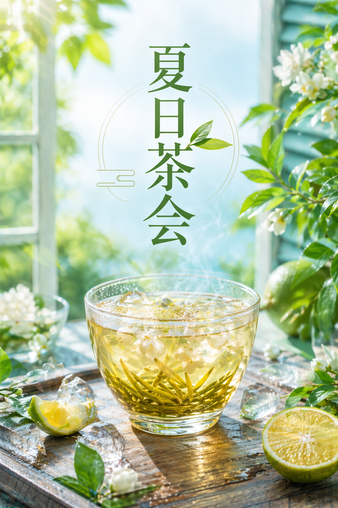

# GPT Image Skill

Codex skill for `gpt-image-2` image generation and image editing through an OpenAI-compatible Images API.

It turns user image requests into concise English prompts, keeps requested in-image Chinese text verbatim, extracts image parameters, and calls a configurable `BASE_URL`.

This project supports `gpt-image-2` only.

## Capabilities

- Generate new images with `gpt-image-2`.
- Edit existing images with `gpt-image-2`.
- Use a custom OpenAI-compatible `BASE_URL`.
- Configure `size`, `quality`, `output_format`, `background`, `n`, `moderation`, `output_compression`, and `timeout`.
- Use one or more input images for edits.
- Use a PNG mask with alpha for local edits.

## Requirements

- Codex with local skill support.
- Python 3.10 or newer.
- Optional but recommended: `uv`.
- An OpenAI-compatible image API key and base URL.

The script uses only the Python standard library.

## Installation

```bash
git clone https://github.com/Galaxy-Yearn/gpt-image.git ~/.codex/skills/gpt-image
```

PowerShell:

```powershell
git clone https://github.com/Galaxy-Yearn/gpt-image.git "$env:USERPROFILE\.codex\skills\gpt-image"
```

If `CODEX_HOME` is set, install under:

```bash
$CODEX_HOME/skills/gpt-image
```

## Configuration

```bash
cp .env.example .env
```

PowerShell:

```powershell
Copy-Item .env.example .env
```

Required:

```text
BASE_URL=https://your-openai-compatible-base-url/v1
API_KEY=your-api-key
MODEL=gpt-image-2
```

Optional defaults:

```text
SIZE=auto
QUALITY=auto
OUTPUT_FORMAT=png
N=1
BACKGROUND=auto
# OUTPUT_COMPRESSION=90
MODERATION=auto
TIMEOUT_SECONDS=600
```

`BASE_URL` must include the complete API path. The script does not append `/v1`.

Do not commit `.env`.

## Usage

Generate with `uv`:

```bash
uv run python scripts/gpt_image.py generate \
  --prompt "A clean studio product photograph of a ceramic coffee cup, warm neutral background, soft morning light, no logo, no text, no watermark" \
  --size 1536x1024 \
  --quality high \
  --output-format png \
  --out output/gpt-image/coffee-cup.png
```

Generate with local Python:

```bash
python scripts/gpt_image.py generate \
  --prompt "A clean studio product photograph of a ceramic coffee cup, warm neutral background, soft morning light, no logo, no text, no watermark" \
  --size 1536x1024 \
  --quality high \
  --output-format png \
  --out output/gpt-image/coffee-cup.png
```

Edit with `uv`:

```bash
uv run python scripts/gpt_image.py edit \
  --image assets/examples/spring-tea-poster.png \
  --prompt-file tmp/gpt-image/summer-tea-edit.txt \
  --size 1024x1536 \
  --quality high \
  --output-format png \
  --out output/gpt-image/summer-tea-edit.png
```

Edit with local Python:

```bash
python scripts/gpt_image.py edit \
  --image assets/examples/spring-tea-poster.png \
  --prompt-file tmp/gpt-image/summer-tea-edit.txt \
  --size 1024x1536 \
  --quality high \
  --output-format png \
  --out output/gpt-image/summer-tea-edit.png
```

For prompts containing quotes, semicolons, newlines, or visible non-ASCII text, prefer `--prompt-file`.

## gpt-image-2 Parameters

This skill implements these `gpt-image-2` request parameters:

| API field | CLI / config | Supported values |
| --- | --- | --- |
| `model` | `--model`, `MODEL` | `gpt-image-2` only |
| `prompt` | `--prompt`, `--prompt-file` | Text prompt |
| `size` | `--size`, `SIZE` | `auto` or `WIDTHxHEIGHT` satisfying the constraints below |
| `quality` | `--quality`, `QUALITY` | `auto`, `low`, `medium`, `high` |
| `output_format` | `--output-format`, `OUTPUT_FORMAT` | `png`, `jpeg`, `webp` |
| `n` | `--n`, `N` | Integer `1..10` |
| `background` | `--background`, `BACKGROUND` | `auto`, `opaque` |
| `output_compression` | `--output-compression`, `OUTPUT_COMPRESSION` | Integer `0..100`; only for `jpeg` and `webp` |
| `moderation` | `--moderation`, `MODERATION` | `auto`, `low` |

Edit-only inputs:

| API field | CLI | Supported values |
| --- | --- | --- |
| `image[]` | `--image` | Repeat `--image <path>` up to `16` times; local `png`, `jpg`, `jpeg`, `webp` files, each `<= 50MB` |
| `mask` | `--mask` | Optional PNG with alpha, `<= 4MB`, same dimensions as the first input image |

Rules enforced by the script:

- `gpt-image-2` only.
- `transparent` background is rejected.
- `output_compression` only with `jpeg` or `webp`.
- For `edit`, at least one `--image` is required.
- For `edit`, `--mask` must be PNG with alpha and match the first input image size.
- Do not send `input_fidelity` with `gpt-image-2`.

Size constraints:

- `auto` is supported.
- Popular sizes include `1024x1024`, `1536x1024`, `1024x1536`, `2048x2048`, `2048x1152`, `3840x2160`, and `2160x3840`.
- Custom `WIDTHxHEIGHT` is supported when both edges are multiples of `16px`.
- Maximum edge length is `3840px`.
- Long edge to short edge ratio must not exceed `3:1`.
- Total pixels must be between `655,360` and `8,294,400`.

Parameter precedence:

```text
CLI flag > .env key > environment variable alias > script default
```

## Example: Chinese Prompt To Generation

Original user request:

```text
生成一张高清竖版中文茶饮海报，主题是春日茶会，画面中有一杯冒着热气的茉莉花茶，阳光、茶叶、木桌，整体高级干净；图片中写“春日茶会”。
```

Prompt sent to `gpt-image-2`:

```text
A high-resolution vertical poster for a Chinese tea drink campaign. Centered composition with a steaming glass cup of jasmine tea on a warm wooden table, soft spring sunlight, fresh green tea leaves, subtle mist, elegant modern Chinese poster design, clean premium layout. Text: "春日茶会". Constraint: render exactly this Chinese text and no additional text; no watermark, no signature.
```

Parameters:

```text
model=gpt-image-2
size=1024x1536
quality=high
output_format=png
n=1
```

Result:


## Example: Chinese Prompt To Image Edit

Original Chinese request:

```text
基于这张春日茶会海报改成夏日冰茶海报，保留高级海报版式和居中产品构图，把饮品改成带冰块的冰茉莉茶，整体更明亮清爽，增加一点柑橘点缀，主文字改成“夏日茶会”。
```

Prompt sent to `gpt-image-2`:

```text
Turn this existing vertical Chinese tea poster into a refined summer iced tea campaign poster. Keep the premium poster layout and the centered product composition, but change the drink to an iced jasmine tea with visible ice cubes, brighter daylight, fresh citrus accents, cooler green and cyan tones, and a cleaner summer atmosphere. Text: "夏日茶会". Constraint: render exactly this Chinese text and no additional text; no watermark, no signature.
```

Parameters:

```text
model=gpt-image-2
size=1024x1536
quality=high
output_format=png
n=1
image[]=assets/examples/spring-tea-poster.png
```

CLI:

```bash
python scripts/gpt_image.py edit \
  --image assets/examples/spring-tea-poster.png \
  --prompt-file tmp/gpt-image/summer-tea-edit.txt \
  --size 1024x1536 \
  --quality high \
  --output-format png \
  --n 1 \
  --out output/gpt-image/summer-tea-edit.png
```

Result:



## Project Files

- `SKILL.md`: concise instructions for Codex.
- `scripts/gpt_image.py`: CLI for `generate` and `edit`.
- `references/prompting.md`: optional prompt guidance for complex requests.
- `agents/openai.yaml`: UI metadata.
- `.env.example`: safe config template.

## Official References

- Image generation guide: https://platform.openai.com/docs/guides/image-generation
- Images create API: https://platform.openai.com/docs/api-reference/images/create
- Images edit API: https://platform.openai.com/docs/api-reference/images/create-edit
- `gpt-image-2` model page: https://platform.openai.com/docs/models/gpt-image-2
