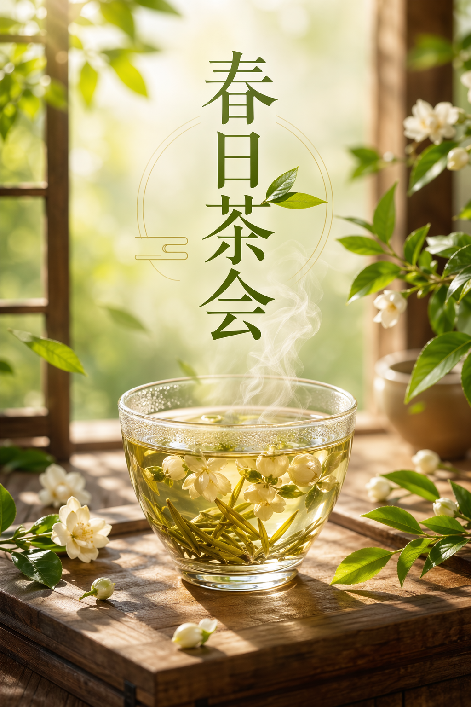

# GPT Image Skill

Codex skill for generating raster images with `gpt-image-2` through an OpenAI-compatible Images API. It is designed for text-to-image workflows where Codex turns the user's request into a concise English image prompt, extracts generation parameters, and calls a configurable endpoint.

## Capabilities

- Generate new images with `gpt-image-2`.
- Use a custom OpenAI-compatible `BASE_URL`.
- Configure model, size, quality, output format, image count, moderation, background, compression, and timeout.
- Convert Chinese image requests into English prompts while preserving requested in-image Chinese text verbatim.
- Save generated images to local project paths.

This skill only supports `gpt-image-2` image generation. It does not edit existing images and does not support other image models.

## Requirements

- Codex with local skill support.
- Python 3.10 or newer.
- Optional but recommended: `uv`.
- An OpenAI-compatible image API key and base URL.

The Python script uses only the standard library; there are no package dependencies.

## Installation

Clone or copy this repository into your Codex skills directory:

```bash
git clone https://github.com/Galaxy-Yearn/gpt-image.git ~/.codex/skills/gpt-image
```

On Windows PowerShell:

```powershell
git clone https://github.com/Galaxy-Yearn/gpt-image.git "$env:USERPROFILE\.codex\skills\gpt-image"
```

If `CODEX_HOME` is set, install under:

```bash
$CODEX_HOME/skills/gpt-image
```

## Configuration

Copy the example env file and fill in your values:

```bash
cp .env.example .env
```

Windows PowerShell:

```powershell
Copy-Item .env.example .env
```

Required:

```text
BASE_URL=https://your-openai-compatible-base-url/v1
API_KEY=your-api-key
MODEL=gpt-image-2
```

Optional defaults:

```text
SIZE=auto
QUALITY=auto
OUTPUT_FORMAT=png
N=1
BACKGROUND=auto
# OUTPUT_COMPRESSION=90
MODERATION=auto
TIMEOUT_SECONDS=600
```

`BASE_URL` must include the complete API base path. The script does not append `/v1`.

Do not commit `.env`; it is ignored by `.gitignore`.

## Usage

With `uv`:

```bash
uv run python scripts/gpt_image.py generate \
  --prompt "A clean studio product photograph of a ceramic coffee cup, warm neutral background, soft morning light, no logo, no text, no watermark" \
  --size 1536x1024 \
  --quality high \
  --output-format png \
  --out output/gpt-image/coffee-cup.png
```

With local Python:

```bash
python scripts/gpt_image.py generate \
  --prompt "A clean studio product photograph of a ceramic coffee cup, warm neutral background, soft morning light, no logo, no text, no watermark" \
  --size 1536x1024 \
  --quality high \
  --output-format png \
  --out output/gpt-image/coffee-cup.png
```

For prompts containing quotes, semicolons, newlines, or visible non-ASCII text, prefer a prompt file:

```bash
mkdir -p tmp/gpt-image
printf '%s\n' 'A polished vertical Chinese tea poster. Warm spring light, jasmine tea, clean premium layout. Text: "春日茶会". Constraint: render exactly this Chinese text and no additional text; no watermark, no signature.' > tmp/gpt-image/prompt.txt

uv run python scripts/gpt_image.py generate \
  --prompt-file tmp/gpt-image/prompt.txt \
  --size 1024x1536 \
  --quality high \
  --output-format png \
  --out output/gpt-image/tea-poster.png
```

## Example: Chinese Prompt To Final Image

Original user request:

```text
生成一张高清竖版中文茶饮海报，主题是春日茶会，画面中有一杯冒着热气的茉莉花茶，阳光、茶叶、木桌，整体高级干净；图片中写“春日茶会”。
```

Prompt sent to `gpt-image-2`:

```text
A high-resolution vertical poster for a Chinese tea drink campaign. Centered composition with a steaming glass cup of jasmine tea on a warm wooden table, soft spring sunlight, fresh green tea leaves, subtle mist, elegant modern Chinese poster design, clean premium layout. Text: "春日茶会". Constraint: render exactly this Chinese text and no additional text; no watermark, no signature.
```

Generation parameters:

```text
model=gpt-image-2
size=1024x1536
quality=high
output_format=png
n=1
```

CLI call:

```bash
uv run python scripts/gpt_image.py generate \
  --prompt-file tmp/gpt-image/spring-tea-poster.txt \
  --size 1024x1536 \
  --quality high \
  --output-format png \
  --n 1 \
  --out output/gpt-image/spring-tea-poster.png
```

Result:



## gpt-image-2 Parameters

The `POST /v1/images/generations` request used by this skill accepts these `gpt-image-2` parameters:

| API field | CLI flag / config | Supported values |
| --- | --- | --- |
| `model` | `--model`, `MODEL` | `gpt-image-2` only |
| `prompt` | `--prompt` or `--prompt-file` | Text prompt |
| `size` | `--size`, `SIZE` | `auto` or `WIDTHxHEIGHT` satisfying the gpt-image-2 constraints below |
| `quality` | `--quality`, `QUALITY` | `auto`, `low`, `medium`, `high` |
| `output_format` | `--output-format`, `OUTPUT_FORMAT` | `png`, `jpeg`, `webp` |
| `n` | `--n`, `N` | Integer `1..10` |
| `background` | `--background`, `BACKGROUND` | `auto`, `opaque` |
| `output_compression` | `--output-compression`, `OUTPUT_COMPRESSION` | Integer `0..100`; only for `jpeg` and `webp` |
| `moderation` | `--moderation`, `MODERATION` | `auto`, `low` |

`gpt-image-2` does not support transparent backgrounds. This skill rejects `--background transparent`.

Official `gpt-image-2` size constraints:

- `auto` is supported.
- Popular fixed sizes include `1024x1024`, `1536x1024`, `1024x1536`, `2048x2048`, `2048x1152`, `3840x2160`, and `2160x3840`.
- Maximum edge length must be `<= 3840px`.
- Both edges must be multiples of `16px`.
- Long edge to short edge ratio must not exceed `3:1`.
- Total pixels must be at least `655,360` and at most `8,294,400`.
- Outputs above `2560x1440` total pixels are described by OpenAI as experimental.

Utility-only script flags:

- `--extra key=value`: pass through an additional field only if it is compatible with `gpt-image-2`.
- `--dry-run`: print endpoint, output paths, and JSON payload without calling the API.
- `--out` / `--out-dir`: choose local save paths.
- `--env`, `--base-url`, `--api-key`, `--timeout`, `--force`: local execution controls, not model parameters.

Official references:

- Image generation guide: https://platform.openai.com/docs/guides/image-generation
- Image API reference: https://platform.openai.com/docs/api-reference/images/create
- gpt-image-2 model page: https://platform.openai.com/docs/models/gpt-image-2

Parameter precedence:

```text
CLI flag > .env key > environment variable alias > script default
```

## Skill Files

- `SKILL.md`: concise instructions loaded by Codex when the skill is invoked.
- `scripts/gpt_image.py`: generation CLI.
- `references/prompting.md`: optional prompt-shaping guidance for complex requests.
- `agents/openai.yaml`: UI metadata.
- `.env.example`: safe configuration template.
